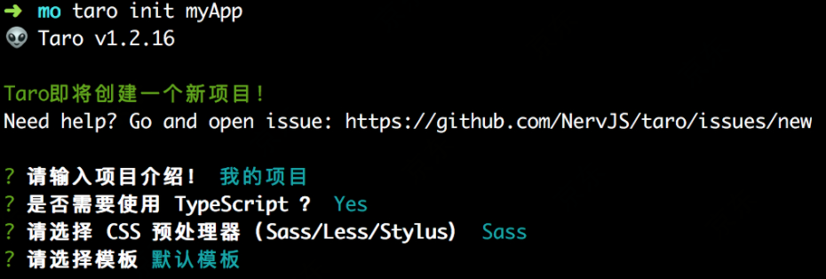

## Taro简介

React语法，实现一套代码多端适配，我们可以只编写一套代码，再通过Taro的编译工具，将源代码分别编译出可以在不同端运行的代码。微信小程序开发有很多弊端：

- 无法使用npm进行第三方库的管理
- 无法使用较新的ES规范

针对这些弊端，Taro有很多优秀特性：

- 支持npm/yarn管理第三方依赖
- 支持ES新规范
- 支持CSS预编译器
- 支持Redux/MobX进行状态管理

### 快速开始

安装cli

```
npm install -g @tarojs/cli
yarn global add @tarojs/cli
```

安装过程出sass错：

```
 npm install -g mirror-config-china
```

查看版本信息：

```
npm info @tarojs/cli
```

查看帮助命令：

```
$ taro --help
```

项目初始化：

```
 taro init myApp
```

npm 5.2+ 也可在不全局安装的情况下使用 npx 创建模板项目

```
npx @tarojs/cli init myApp
```



一般依赖安装不会有问题，出问题自己npm install，Taro需要运行不同的命令将代码编译成不同端的代码，在对应开发工具中查看效果。注意不只命令不同，不同模式也有差异，自行看官方文档

Taro 提供了更新命令来更新自身cli和项目中Taro相关依赖，更新taro工具：

```
# taro
$ taro update self
# npm
npm i -g @tarojs/cli@latest
# yarn
yarn global add @tarojs/cli@latest
```

更新taro相关依赖：
```
$ taro update project
```
